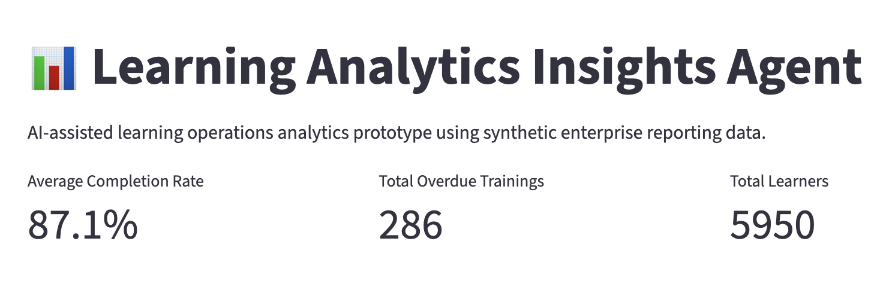

# Learning Analytics Insights Agent

An AI-assisted enterprise learning analytics dashboard prototype designed to simulate operational reporting, compliance monitoring, and learning insights generation using synthetic enterprise data.

---

## Business Problem

Enterprise learning teams often struggle to:
- identify compliance risks quickly
- monitor overdue training activity
- consolidate fragmented reporting
- generate executive-ready insights
- prioritize operational interventions

Traditional reporting workflows are frequently manual, reactive, and difficult to scale across large organizations.

---

## Proposed Solution

The Learning Analytics Insights Agent simulates an AI-enabled analytics experience that helps enterprise learning teams:
- visualize learning performance metrics
- identify high-risk operational areas
- monitor overdue training trends
- support governance reporting
- surface actionable operational insights

This prototype uses fictional business scenarios and synthetic reporting data only.

---

## Current Features

### Operational KPI Dashboard
- Average completion rate tracking
- Overdue training visibility
- Learner population metrics

### Interactive Visualizations
- Completion rate analysis by department
- Risk-level reporting views
- Overdue training monitoring

### Synthetic Enterprise Reporting Data
- Simulated departmental learning metrics
- Compliance-risk indicators
- Learner population modeling

---

## Technology Stack

- Python
- Streamlit
- Pandas
- Plotly
- OpenAI API (planned future enhancement)

---

## Screenshots

### Learning Insights Agent



### Completion Rates By Department


### Overdue Training Volume


---

## Future Enhancements

Planned enhancements include:
- AI-generated operational insights
- Executive summary generation
- Department-level filtering
- Trend forecasting
- Predictive compliance risk analysis
- Downloadable executive reports
- Role-based analytics experiences

---

## Local Setup

Run locally:

```bash
pip install -r requirements.txt
python3 -m streamlit run app.py
```

---

## Disclaimer

This project uses fictional organizations, synthetic reporting data, and simulated operational scenarios for portfolio demonstration purposes only.

No proprietary or confidential business information is included.