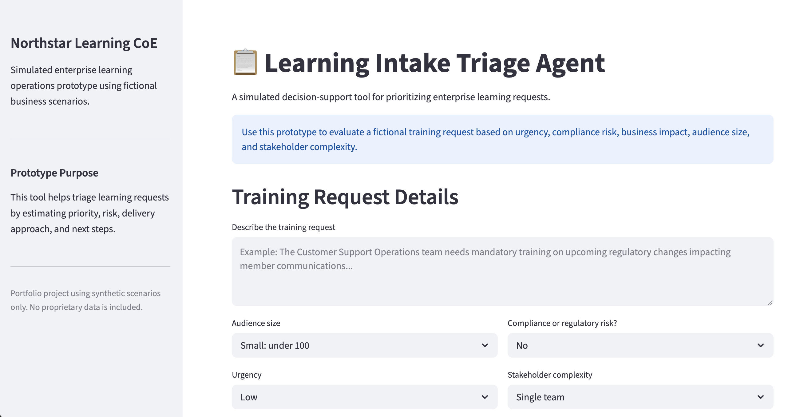
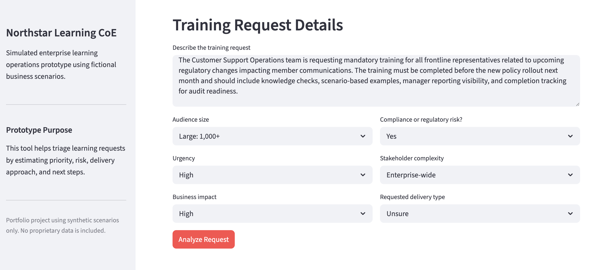
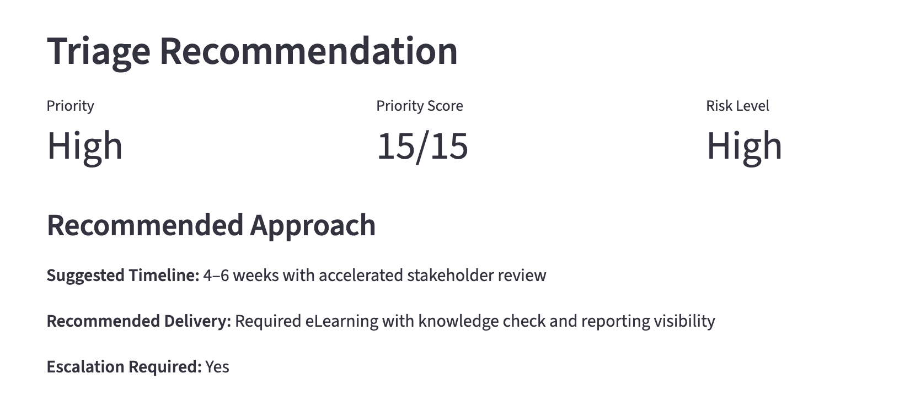
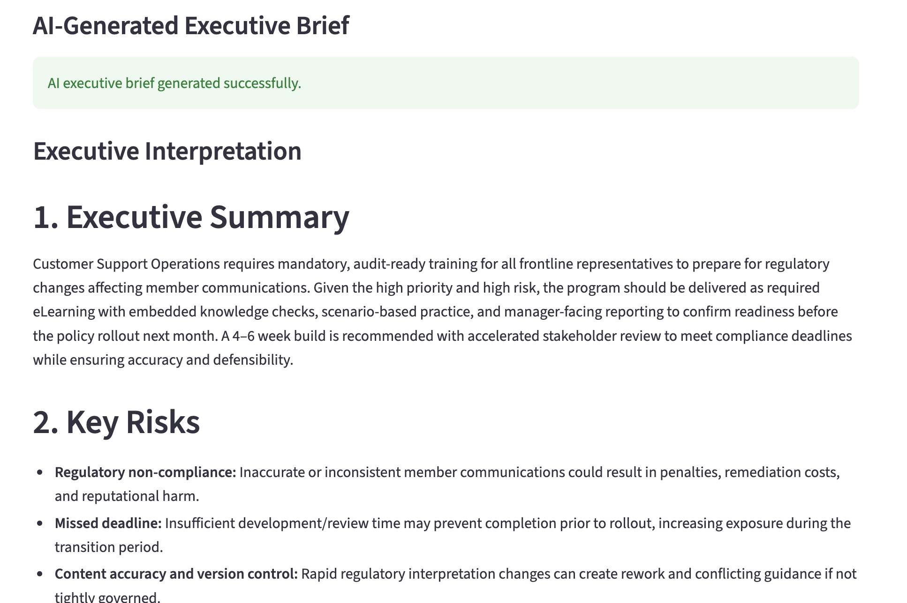

# Enterprise Learning AI Agents Portfolio

## Overview

This repository contains simulated enterprise AI workflow agents designed for learning operations and governance workflows.

## Current Prototype

### Learning Intake Triage Agent

Features include:
- AI-generated executive summaries
- business impact scoring
- stakeholder complexity analysis
- timeline recommendations
- delivery recommendations

## Technology Stack

- Python
- Streamlit
- OpenAI API
- Pandas

## Future Enhancements

- RAG assistant
- analytics copilot
- dashboard visualizations
- public deployment

## Triage Agent Page Example

## Intake Form Filled In

## Triage Recommendations Output

## AI Generated Executive Brief

